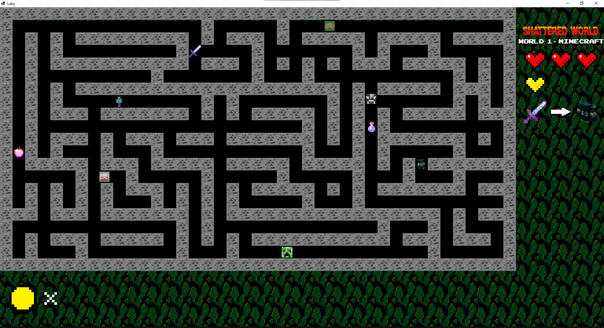
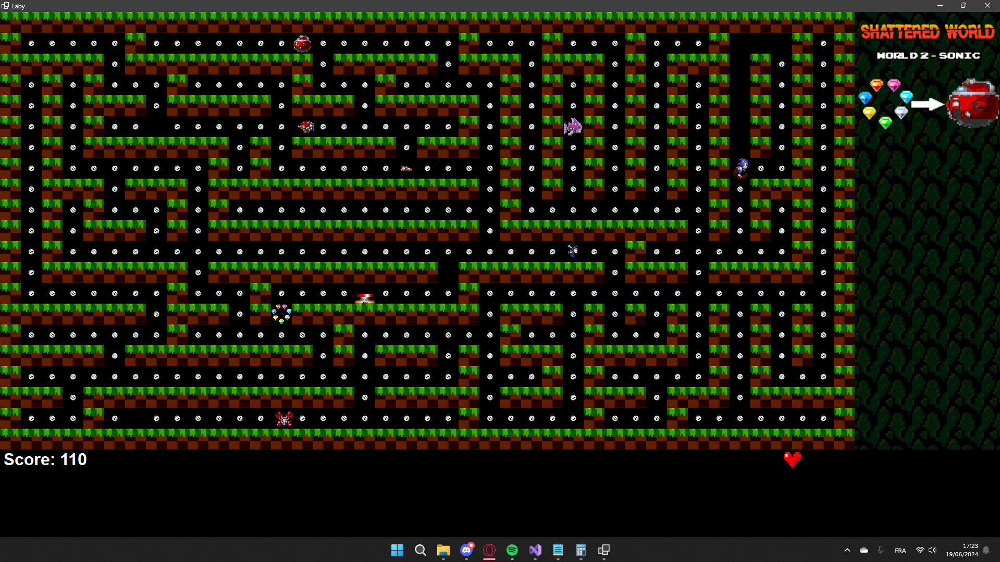
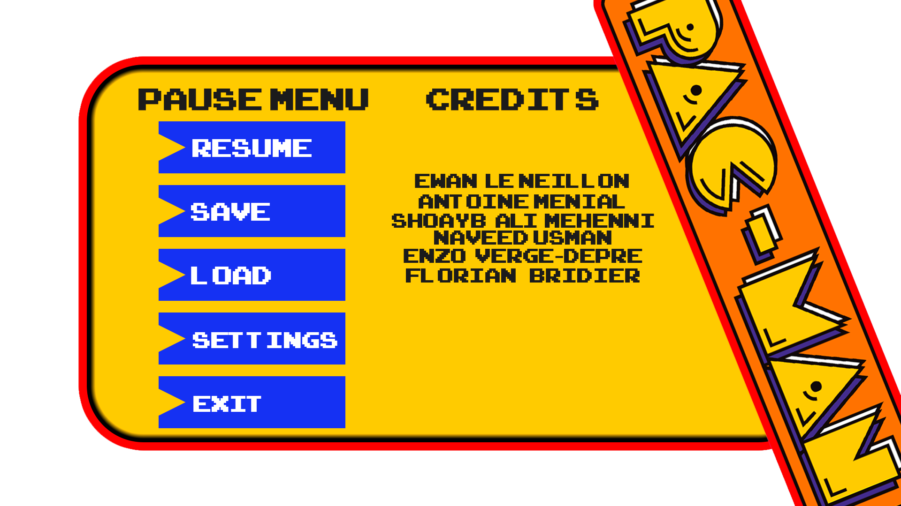

# Pac-Man Shattered World (C#)

Projet universitaire réalisé en équipe : développement d’un jeu Pac-Man en C# (WinForms, .NET 8).

Le concept "Shattered World" repose sur plusieurs mondes inspirés de différents univers vidéoludiques.

## Fonctionnalités

- Gestion des déplacements et collisions
- Système de score et gestion des vies
- Plusieurs mondes (World 1, World 2)
- Menu, pause, fin de partie

## Algorithmes implémentés

- Algorithme de Dijkstra (pathfinding)
- Parcours eulérien
- Logique de graphes
- Gestion des états du jeu

## Technologies

- C# (.NET 8)
- WinForms
- Programmation orientée objet

## Aperçu

## Démo vidéo

[Voir la démo complète](media/demo.mp4)

## 📄 Rapport

➡️ [Consulter le rapport complet (PDF)](rapportPacman.pdf)

